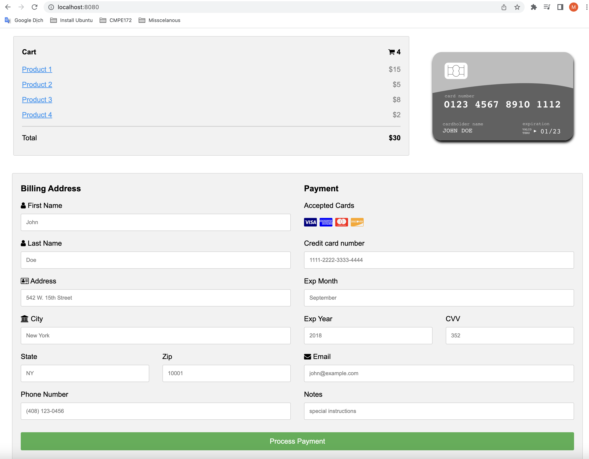
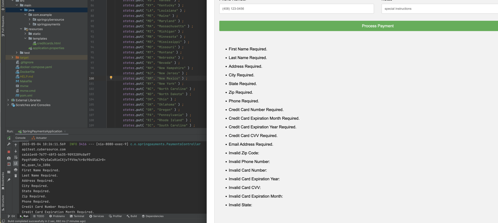
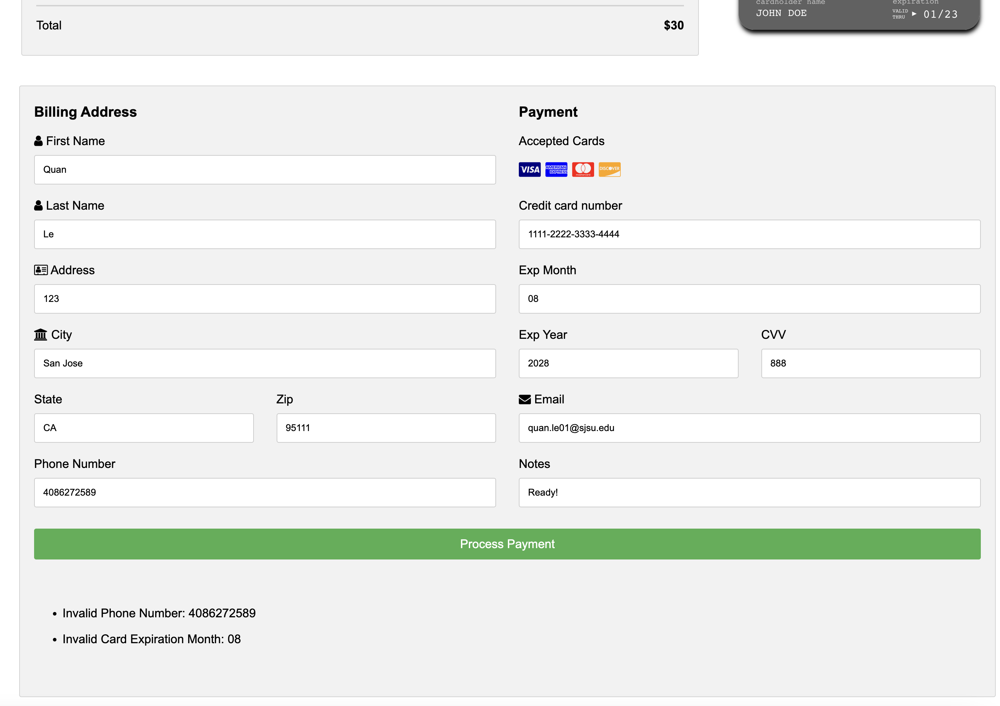
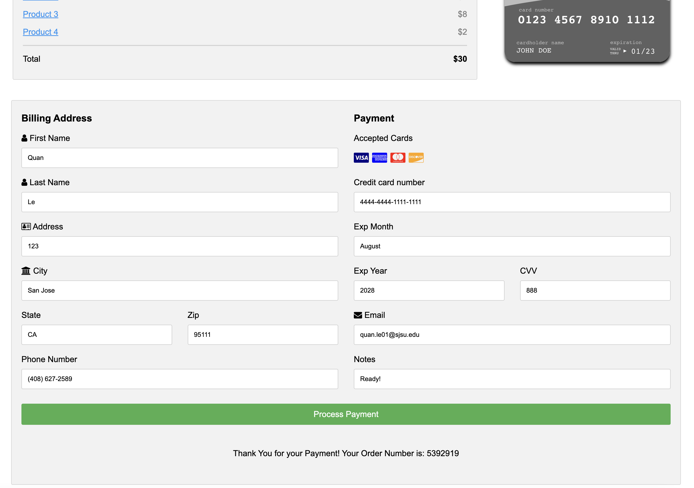
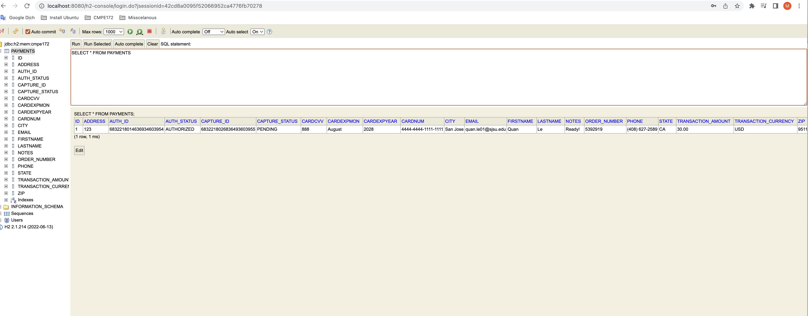
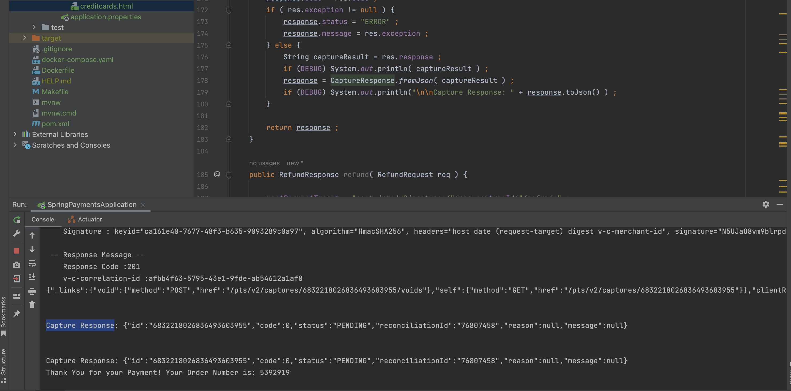
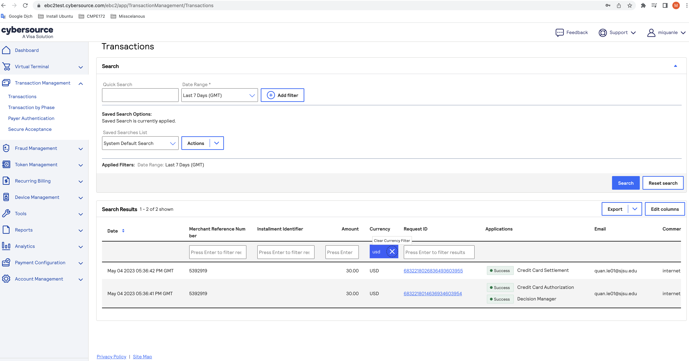

# CMPE 172 - Lab #7 Notes

# Submit a Link to to your assigned GitHub Repo for Lab #7
+ Should include all source code changes you made to the Starter Code
# Screenshots
+ Sample Payment Screen Output similar to above (but with "full background/desktop" of your laptop/pc) 
   
  + Also include Screenshots providing Evidence of
   
   
    + Results of a Successful Payment with E2E Payment Details:
      + Payment Form + CyberSource API Results + Cybersource EBC Transactions Dashboard
      + I.E. Auth and Capture Payment Id & Status, Transaction Amount & Currency and Order Number.
   
   
   
   
# Lab Notes should include:
      Discussion of the Lombok, ThymeLeaf and Spring Features you used in this Lab.
      Discuss why Jackson is needed and where it is used in the code for this Lab.