# CMPE 172 - Lab #8 Notes

# Submit a Link to to your assigned GitHub Repo for Lab #8
# Screenshots
    + Screenshots of your "full" desktop for each step (as shown above).
        + "Full Desktop Screenshots" are required to ensure your work is your own!
    + Screenshots of your Postman API Tests with Request and Response and API key header
# Lab Notes should include:
    + Any challenges you face while working on this lab (i.e. GKE deployment issues) and how you overcame / solved them.
    + A discussion of what changes would be needed in order to deploy your Starbucks API with MySQL / Cloud SQL.
# Run Starbucks API in Docker
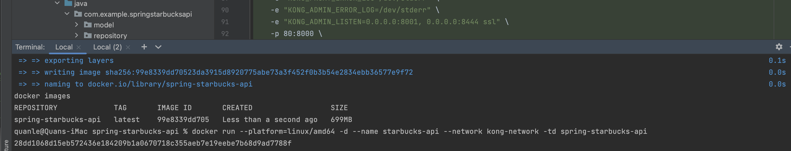 
 
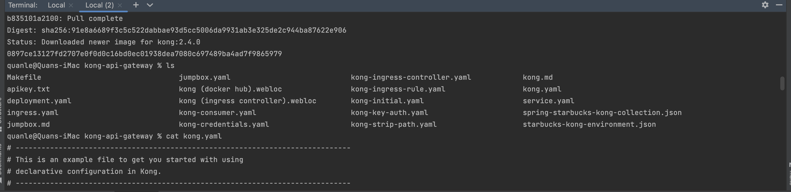 
# Run Kong Docker in DB-Less Mode
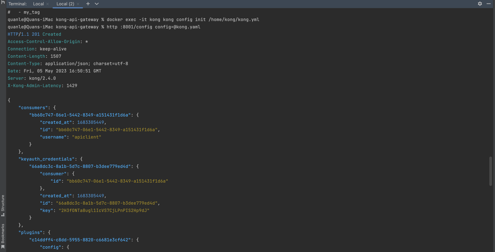 
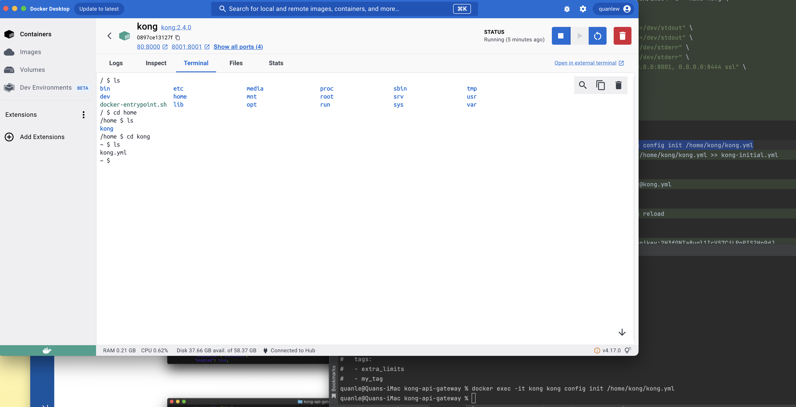 
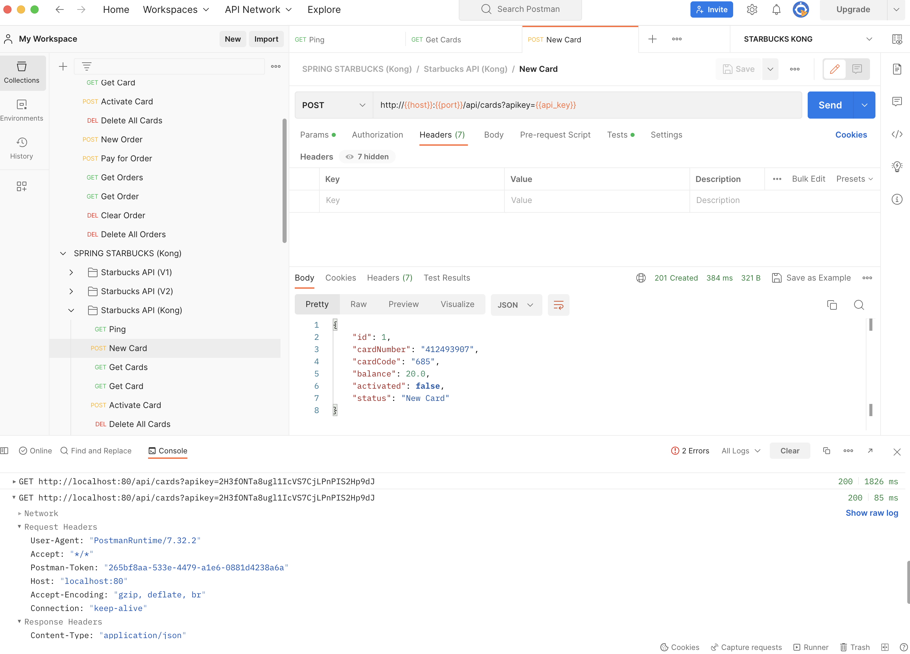 
# Deploy Kong on Google GKE
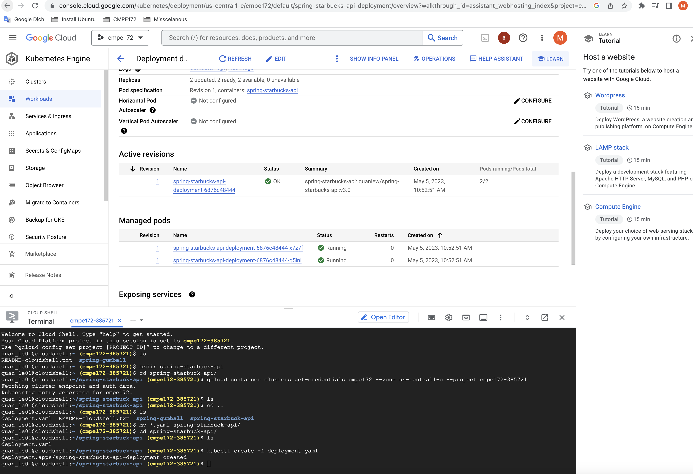 
# Create a Service for Starbucks API
# Test Reachability from GKE Jumbox Pod
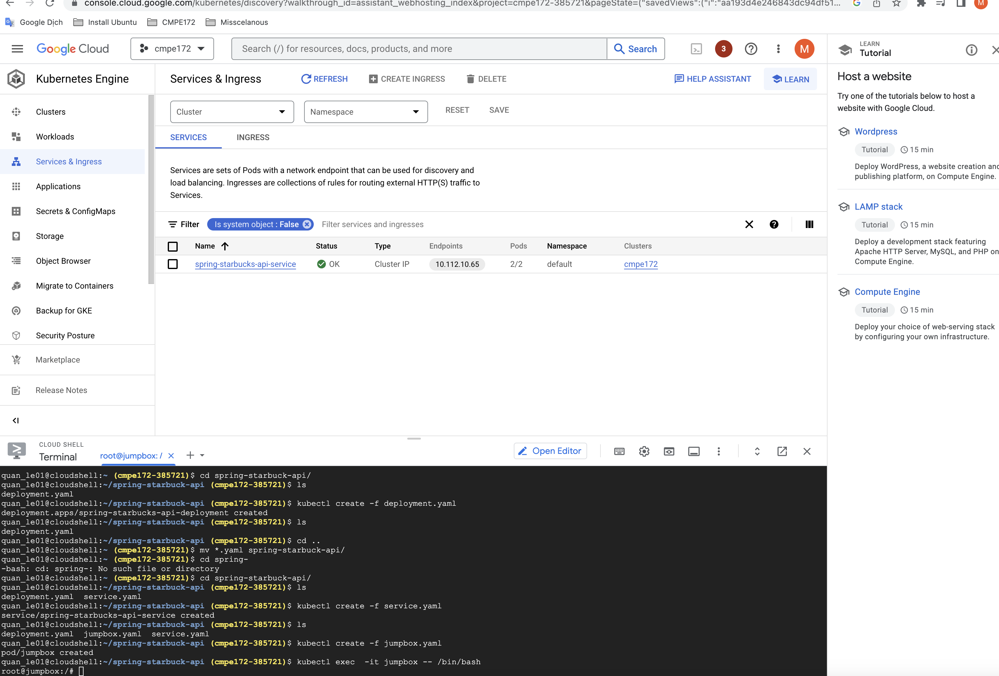 
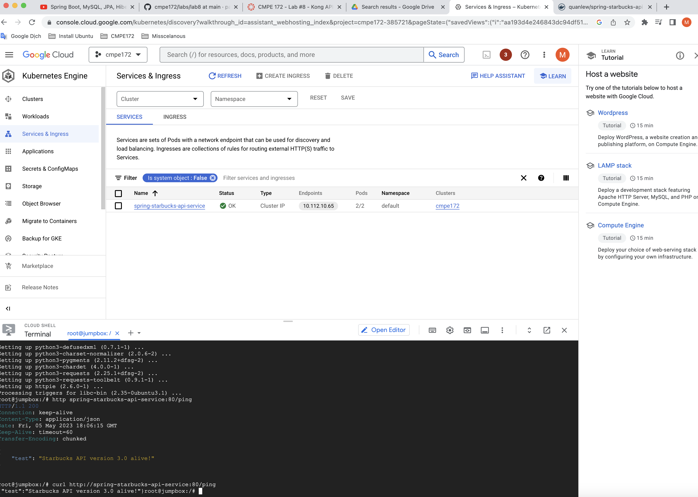 
# Install Kong GKE Ingress Controller
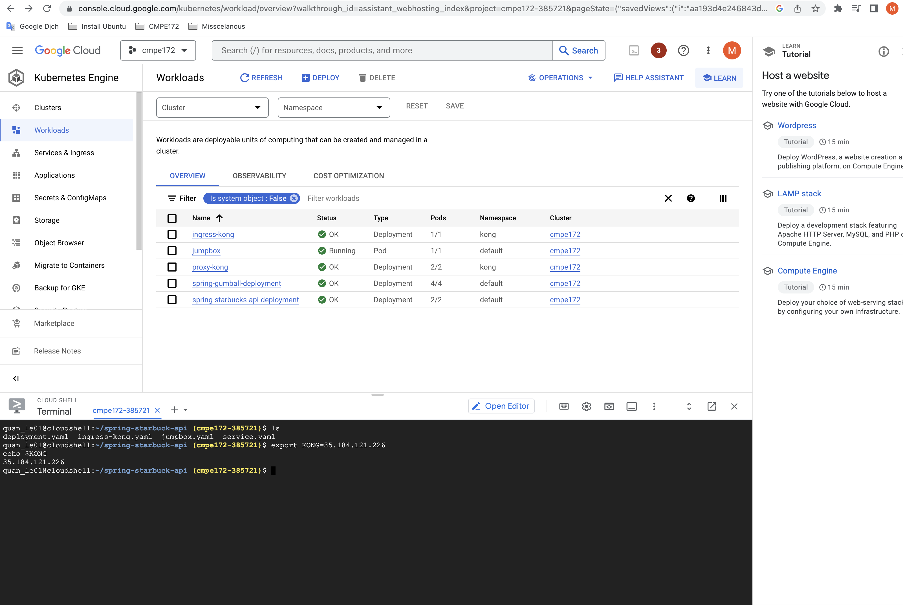 
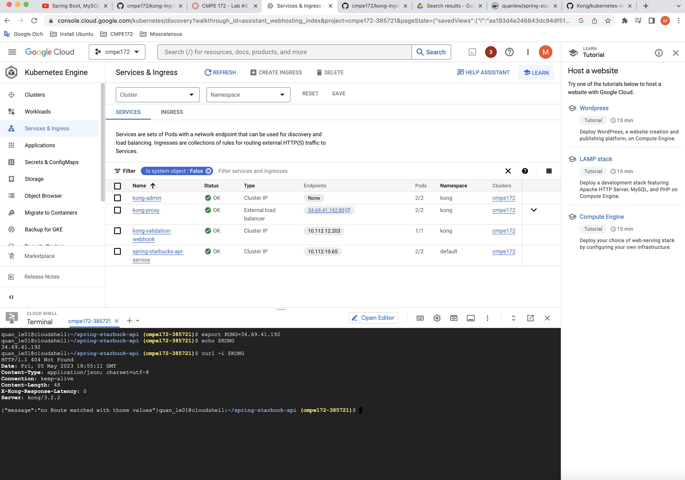 
# Create an Ingress rule to proxy the Starbucks Service
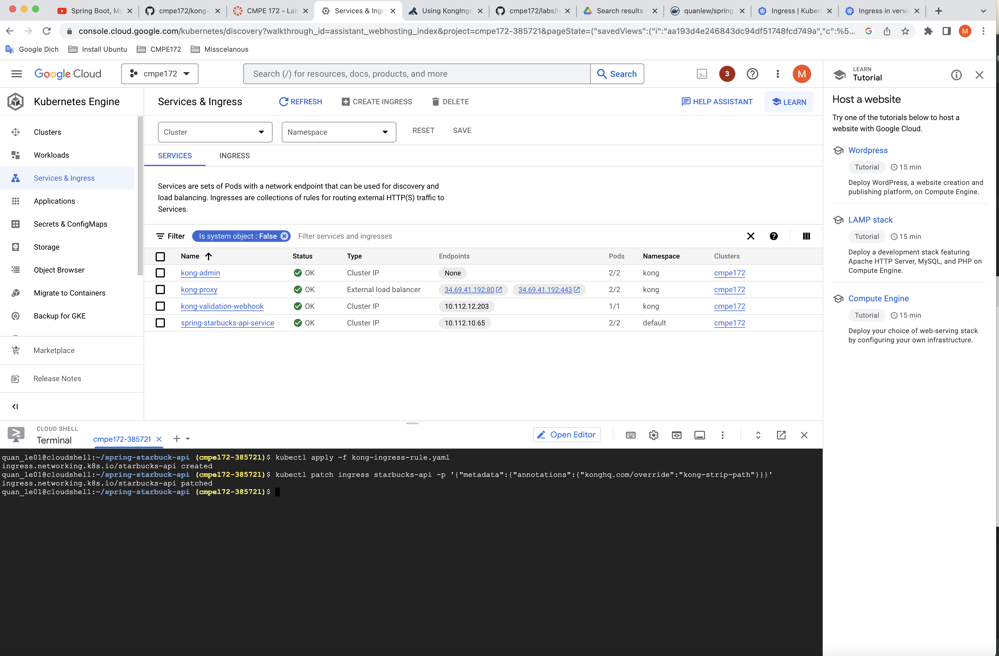 
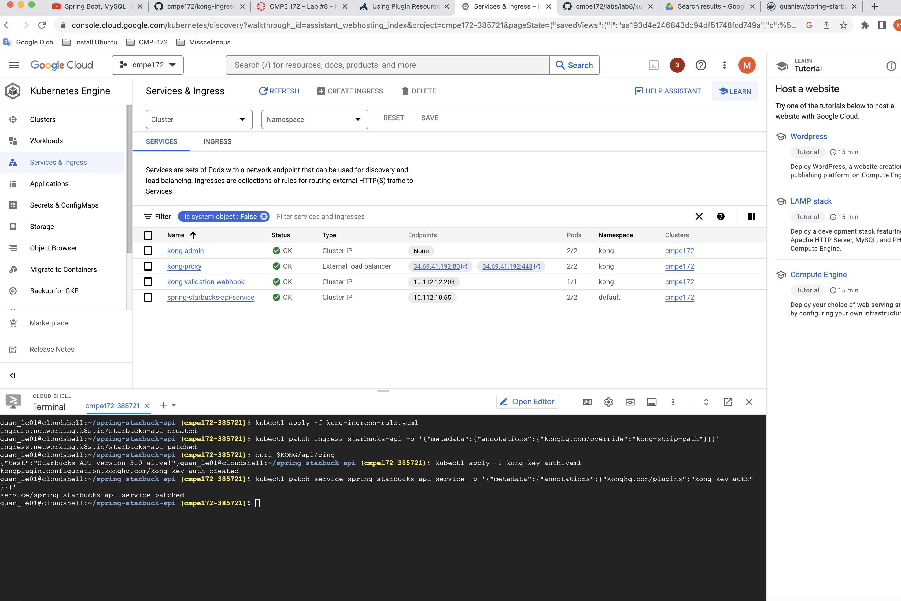 
# Test Kong API Ping Endpoint
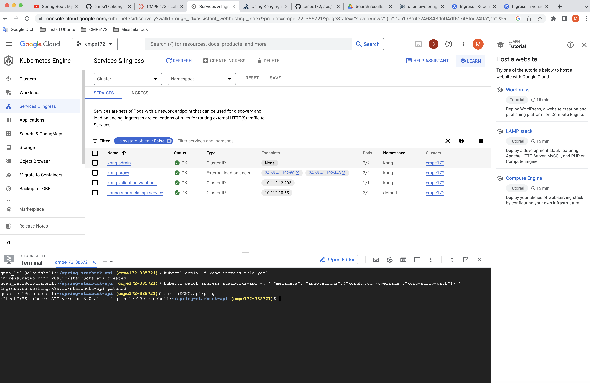 
# Add Kong Key-Auth PlugIn
# Configure an API Client Key
 
# Apply API Key Credentials to API Client
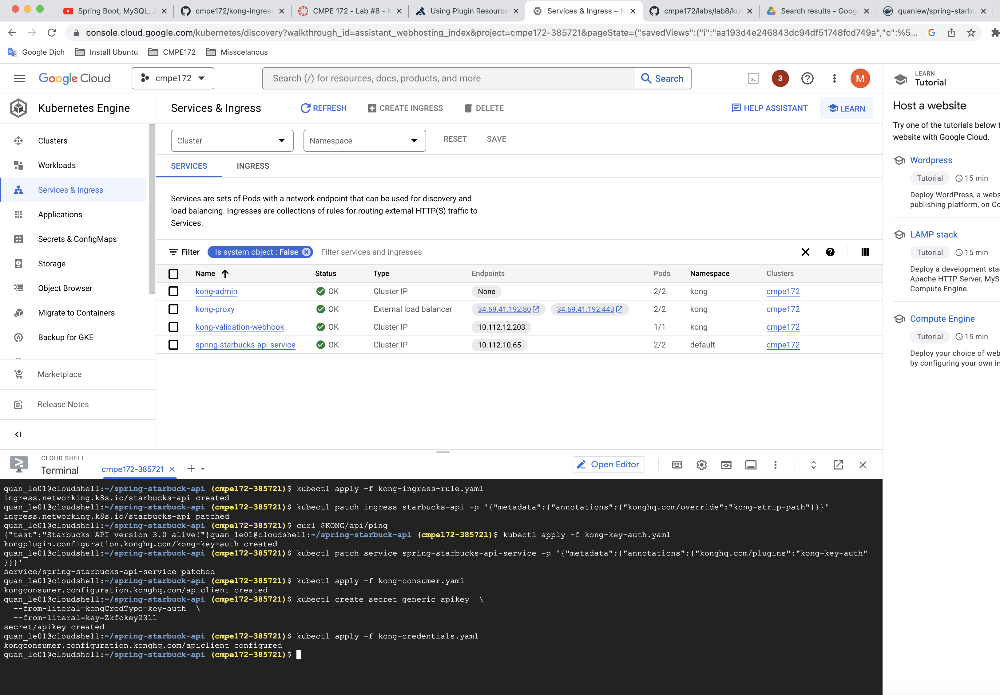 
# Test Your API Against Kong via Public IP of Load Balancer
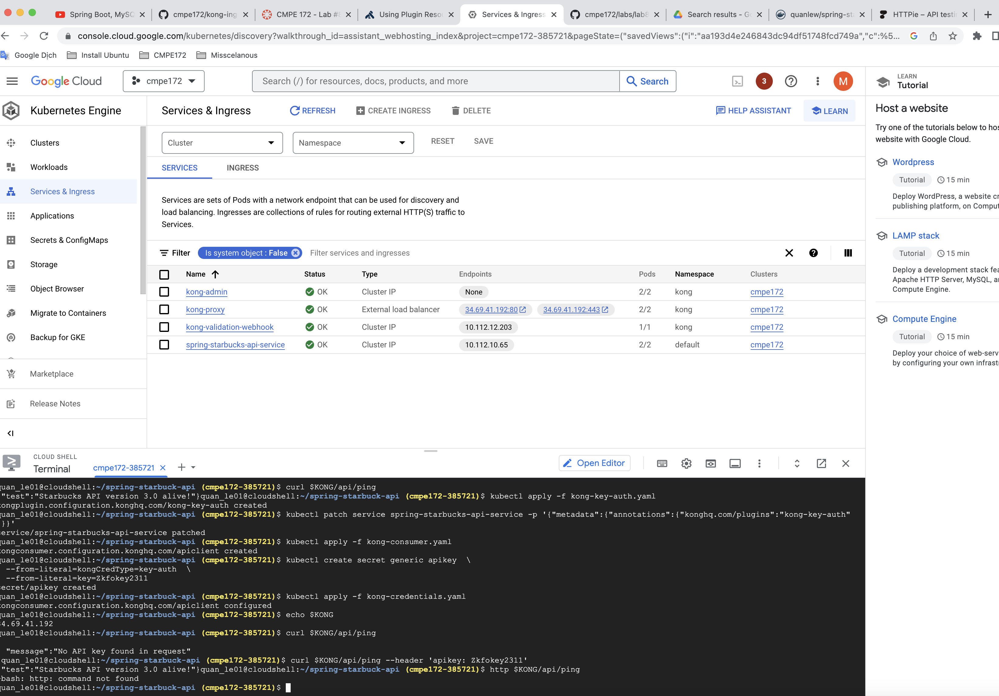 
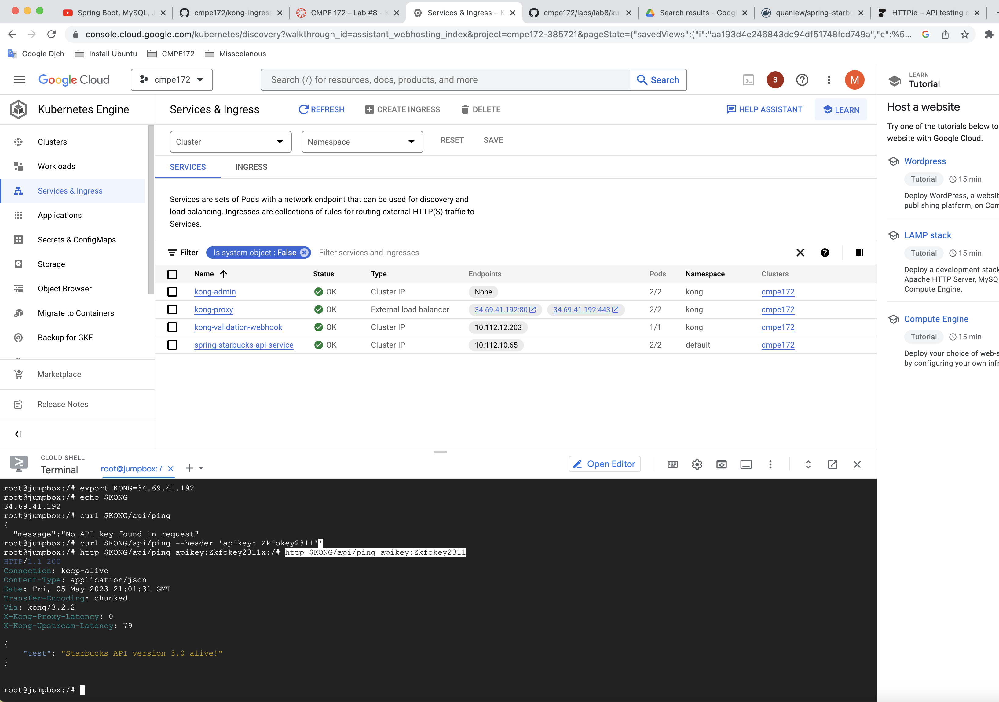 