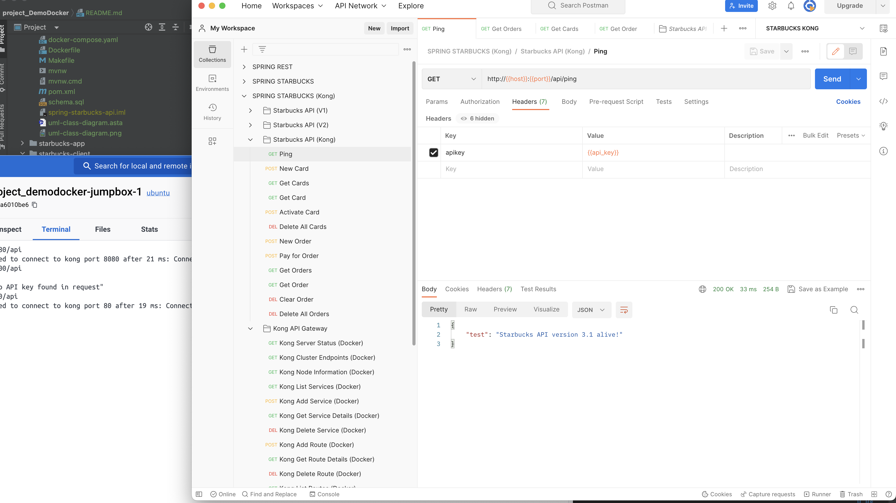

```
CREATE TABLE SPRING_SESSION (
  PRIMARY_ID CHAR(36) NOT NULL,
  SESSION_ID CHAR(36) NOT NULL,
  CREATION_TIME BIGINT NOT NULL,
  LAST_ACCESS_TIME BIGINT NOT NULL,
  MAX_INACTIVE_INTERVAL INT NOT NULL,
  EXPIRY_TIME BIGINT NOT NULL,
  PRINCIPAL_NAME VARCHAR(100),
  CONSTRAINT SPRING_SESSION_PK PRIMARY KEY (PRIMARY_ID)
) ENGINE=InnoDB ROW_FORMAT=DYNAMIC;

CREATE UNIQUE INDEX SPRING_SESSION_IX1 ON SPRING_SESSION (SESSION_ID);
CREATE INDEX SPRING_SESSION_IX2 ON SPRING_SESSION (EXPIRY_TIME);
CREATE INDEX SPRING_SESSION_IX3 ON SPRING_SESSION (PRINCIPAL_NAME);

CREATE TABLE SPRING_SESSION_ATTRIBUTES (
  SESSION_PRIMARY_ID CHAR(36) NOT NULL,
  ATTRIBUTE_NAME VARCHAR(200) NOT NULL,
  ATTRIBUTE_BYTES BLOB NOT NULL,
  CONSTRAINT SPRING_SESSION_ATTRIBUTES_PK PRIMARY KEY (SESSION_PRIMARY_ID, ATTRIBUTE_NAME),
  CONSTRAINT SPRING_SESSION_ATTRIBUTES_FK FOREIGN KEY (SESSION_PRIMARY_ID) REFERENCES SPRING_SESSION(PRIMARY_ID) ON DELETE CASCADE
) ENGINE=InnoDB ROW_FORMAT=DYNAMIC;
```

# STARBUCK - FINAL PROJECT - DEMO DOCKER

### 1. Show the Starbucks API "Kong API Gateway" endpoint and API being used.  Demo this via a CURL ping test to API.
<br/>
### 2. Show the launch manifest / configuration for Starbucks Cash Register confirming connection to API via Kong with API Key

### 3. Start up and Log into your Starbucks Cash Register App (your ported Spring MVC version)

### 4. Show the launch command to run Starbucks "Mobile" App with connection to the same Kong API Gateway and API Key

### 5. Start up the "Starbucks Mobile App" pointing out the "Store/Register" ID being used

### 6. Connect to Backend MySQL Database and query the "New Starbucks Card" created by Starbucks Mobile App

### 7. Query to show the Card Number, Card Code and starting Balance in "Activated Status"

